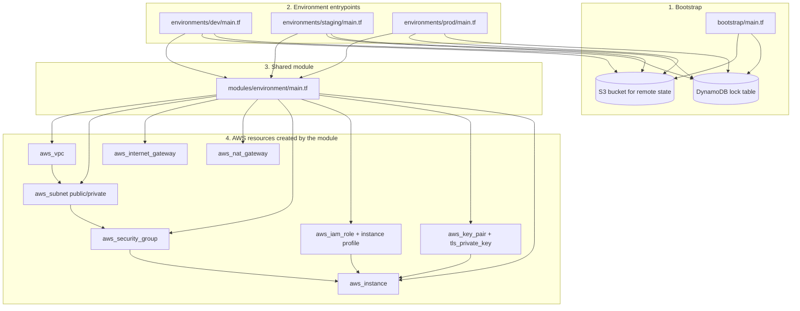

# Terraform architecture diagram

## How it fits together

1. Bootstrap creates the shared S3 bucket and DynamoDB table for remote state and locking.
2. Each environment directory (dev, staging, prod) calls the same shared module.
3. The shared module builds a complete environment stack: networking, security, IAM, key pair, and EC2.
4. Terraform uses the S3 backend to store state and the DynamoDB lock table to prevent two applies from running at the same time.

## Beginner version

Think of this setup like a template plus three small projects:

- The bootstrap step is like setting up the shared storage room.
- Each environment folder is like a different room you want to build: dev, staging, and prod.
- The module is the instruction book that tells Terraform how to build one room.
- Terraform reads the instructions, creates the AWS resources, and saves the results in S3.

In simple terms:

- Dev, staging, and prod each ask for the same kind of environment.
- The shared module makes sure they are built the same way.
- The bootstrap step makes sure Terraform has a safe place to store its state.
- The EC2 instance is the actual server that gets created in AWS.
